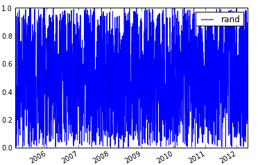
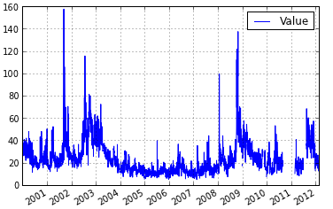
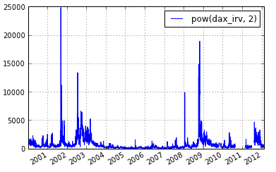
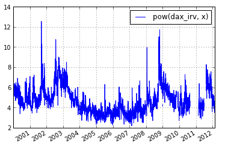
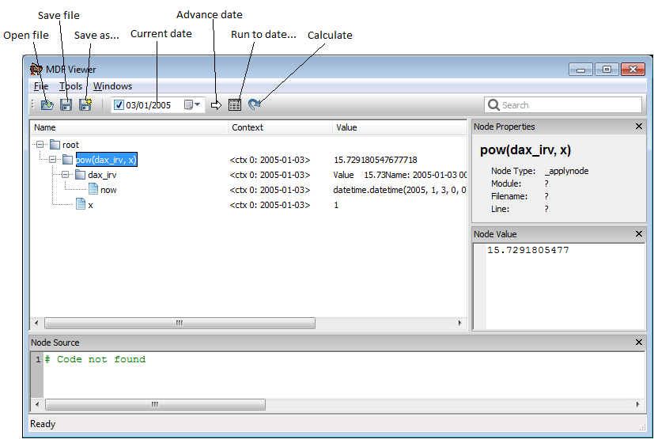
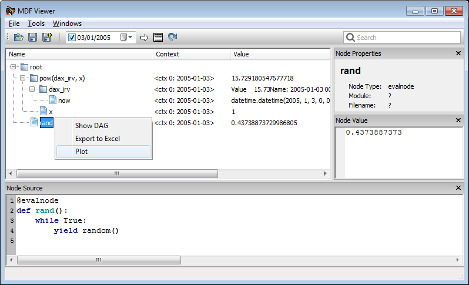

.. py:currentmodule:: mdf

.. _ipython:

Interactive use of MDF in IPython
=================================

MDF has a number of 'magic' functions that make it easier to use interactively in the IPython environment.
IPython 'magic' functions are ones that are invoked with a ``%`` before the name and are not available
outside of IPython as they intended only for interactive work.

To access the magic functions you first need to import everything from the `mdf.lab` module::

    from mdf.lab import *

This will print some brief text telling you that to get more help you need to use the ``%mdf_help``
magic function::

    %mdf_help

Once `mdf.lab` is imported an 'ambient' context is created, so you can evaluate nodes
without specifying any particular context - as you would inside a node function. For example::

    from random import random

    # define a new node
    @evalnode
    def rand():
        while True:
            yield random()

    # call it and it will be evaluated in the ambient context
    rand() # returns a random number

Values of nodes in the current ambient context can be accessed in the normal way by calling
the nodes, and can be set using the ``value`` property

.. sourcecode:: ipython

    In [1]: x = varnode(default=1)

    In [2]: x()
    Out[5]: 1

    In[3]: x.value = 2
    
    In [4]: x()
    Out[4]: 2

As time-dependent nodes are important in mdf it is easy to set and advance the current date
(the `mdf.now` node) in IPython using the magic functions ``%mdf_now`` and ``%mdf_advance``

.. sourcecode:: ipython

    # get the current time set in the ambient context (this is just the same as calling 'now()')
    In [5]: %mdf_now
    Out[5]: datetime.datetime(2012, 5, 2, 0, 0)

    # set the current date
    In [6]: %mdf_now 2005-01-01
    Out[6]: datetime.datetime(2005, 1, 1, 0, 0)
    
    # advance the date
    In [7]: %mdf_advance

    In [8]: %mdf_now
    Out[9]: datetime.datetime(2005, 1, 3, 0, 0)

Notice that the magic functions understand dates as literals so there's no need to construct
datetime objects.

``%mdf_advance`` optionally takes some nodes and returns the values of those nodes after the
timestep. This can be useful for tracking values as you step through a few timesteps

.. sourcecode:: ipython

    In [9]: %mdf_advance rand
    Out[9]: 0.67507466071023625

    In [10]: %mdf_advance rand now
    Out[10]: [0.67751015258066294, datetime.datetime(2005, 1, 5, 0, 0)]

Working with Timeseries
-----------------------

Nodes can be evaluated over a time range to produce time series of results, which can
be plotted, stored as pandas DataFrames or exported to Excel.

The main functions used to construct timeseries of results are:

    * ``%mdf_df`` for creating dataframes
    * ``%mdf_plot`` for plotting using matplotlib
    * ``%mdf_xl`` for exporting to Excel

All these functions take two dates (start and end) followed by a list of nodes (note the use of
``T`` as a shortcut for today)

.. sourcecode:: ipython

    In [11]: %mdf_plot 2005-01-01 T rand

Nodes can be defined interactively either by writing new functions or simply using the
nodetype method syntax (:ref:`nodetype_method_syntax`) to build up series of operation
quickly

.. sourcecode:: ipython

    In [12]: %mdf_plot 2005-01-01 T rand.cumprodnode() rand.nansumnode()

This could also be written as

.. sourcecode:: ipython

    In [13]: a = rand.cumprodnode()

    In [14]: b = rand.nansumnode()

    In [15]: %mdf_plot 2005-01-01 T a b

.. sourcecode:: ipython

In addition to these functions there is also ``%mdf_dfs`` which returns a list of
dataframes (one for each node) and ``%mdf_wp`` which returns a widepanel constructed
from dataframes for each node. These can be useful when evaluating multiple nodes
at the same time but when you don't want the results to get merged into a single
dataframe.

Working with Data
-----------------

Most often data is loaded as a pandas DataFrame, Series or WidePanel. To use those
effectively in mdf we normally define a node that is the 'current' row or item
from that dataset. As time advances that node updates to reveal the data from
the underlying structure.

The :py:func:`datanode` function can be used to construct such a node from
any DataFrame, WidePanel or series that is indexed by date.

The following example shows how to access data in a pandas DataFrame:: 

	from mdf import datanode
	import pandas as pa

    # load some data
    df = pa.DataFrame.from_csv("data_file.csv")
 
    # create a node whose value is the row from the dataframe for 'now'
    df_node = datanode("x", df)
 
This ``df_node`` node is like any other mdf node

.. sourcecode:: ipython

    In [18]: %mdf_plot 2000-01-01 T df_node

Applying Functions
------------------
 
Usually when writing code using mdf new nodes are written whenever a value
derived from other nodes is required

::

    @evalnode
    def df_node_sq():
        return math.pow(df_node(), 2)

For trivial functions such as the one above it can be inconvenient to have
to write these for each desired node.

The :py:func:`applynode` function can be used to create new nodes that
apply a function to other nodes. The above example can be re-written as follows:

.. sourcecode:: ipython

    In [19]: df_node_sq = applynode(math.pow, df_node, 2)

    In [20]: %mdf_plot 2000-01-01 T df_node_sq
    

Accessing the Context and Shifting
----------------------------------

When you want to evaluate a node with another node set to a specific value or overriden
you use a shifted context (see :ref:`shifted_contexts`).

You can get and set the current ambient context using the ``%mdf_ctx`` magic function.
This allows you to get the current context, create a shifted context and then set
that shifted context as the current context.

.. sourcecode:: ipython
 
    In [21]: ctx = %mdf_ctx

    In [22]: x = varnode(default=1)

    In [23]: shifted_ctx = ctx.shift({x : 2})

    In [24]: %mdf_ctx shifted_ctx
    Out[24]: <ctx 1: 2012-05-03 [x=2] at 123373200>

    In [25]: x()
    Out[25]: 2

The functions ``%mdf_df``, ``%mdf_plot`` and ``%mdf_xl`` also take an optional set of
shifts. This makes it easy to get results from a shift without having the get, shift
and set the current context.

.. sourcecode:: ipython

    In [26]: df_node_pow = applynode(math.pow, df_node, x)

    In [27]: %mdf_plot 2000-01-01 T df_node_pow [x=0.5]
    

Using the MDF Viewer
--------------------

The mdf viewer can be used explore the dependencies between nodes and plot or export
values over time.

The mdf viewer can be opened from ipython with the magic command ``%mdf_show``.

.. sourcecode:: ipython

    In [28]: %mdf_show df_node_pow

More nodes can be added to the open viewer using the same command.

.. sourcecode:: ipython

    In [29]: %mdf_show rand

To plot or export nodes select the nodes you want (use Shift or Ctrl to select multiple
nodes) and then right click and select ``plot`` from the context menu. The same context
menu may be used to export values to Excel or to render a graphical representation
of the graph (requires Graphviz to be installed).

Once the viewer is open you can select one or more nodes and then use the magic command
``%mdf_selected`` to get your current selection in your IPython session

.. sourcecode:: ipython

    In [29]: %mdf_selected
    Out[29]: 
    [(<ctx 0: 2005-02-11 at 115387248>,
      <<type 'mdf.nodes.MDFEvalNode'> [name=rand] at 0x30fee48>)]
      
This returns a list of contexts and node objects that correspond to what is selected
in the viewer.

The magic functions ``%mdf_plot``, ``%mdf_df`` and ``%mdf_xl`` can also be used to
plot or get results for the currently selected nodes. To use the currently
selected nodes don't specify any nodes at all on the command line.

.. sourcecode:: ipython

    %mdf_plot 2005-01-01 T

